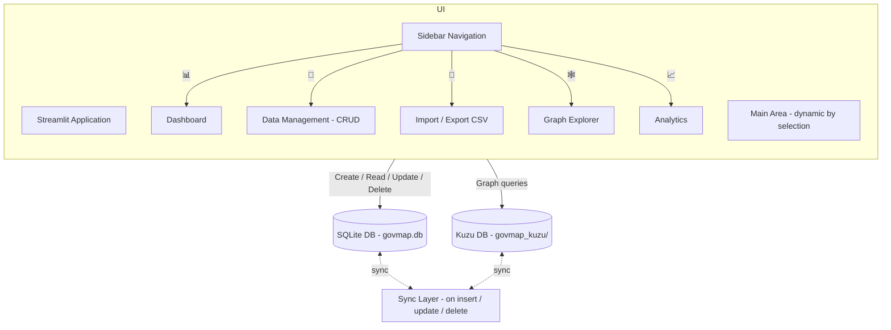

# Stakeholder Mapping

A small knowledge-graph backed stakeholder mapping application. The project stores canonical data in SQLite for CRUD and batch operations, and mirrors the graph model into a Kùzu graph database for relationship traversal and visualisations. A Streamlit UI provide interactive exploration and import/export tools.

## Highlights
- SQLite for canonical CRUD storage (`govmap.db`)
- Kùzu graph DB for relationships and traversal (`govmap.kuzu`)
- Streamlit UI including a Graph Explorer powered by pyvis and small utilities for import/export

## Architecture

Top-level components:

- `database/` — SQLite and Kùzu managers and a sync layer
- `ui/` — Streamlit pages and visualisation helpers
- `data/` — folder for storing exported csv files and some test data

Architecture diagram



## Files you should know

- `app.py` — Streamlit entrypoint and navigation
- `database/sqlite_manager.py` — SQLite schema and CRUD
- `database/kuzu_manager.py` — Kùzu schema and graph upserts/queries
- `database/sync_manager.py` — routines to sync SQLite → Kùzu
- `ui/graph_viz.py` — Streamlit graph explorer UI
- `ui/import_export.py` — CSV import/export pages
- `config.py` — paths and canonical constants (ORG_TYPES, RELATIONSHIP_TYPES, TABLES)

## Quick start (macOS / Linux)

1. Clone the repo

```bash
    git clone <repo>
    cd stakeholder-mapping
```

2. Install uv (recommended)
     - macOS/Linux:
```bash
     curl -LsSf https://astral.sh/uv/install.sh | sh
```
     - Windows (PowerShell as admin):
```powershell
     powershell -ExecutionPolicy ByPass -c "irm https://astral.sh/uv/install.ps1 | iex"
```
     - Homebrew:
```bash
     brew install uv
```

3. Install dependencies. The project defines runtime dependencies in pyproject.toml. With uv:
```bash
# Create/update lockfile and sync env (includes dev group by default)
uv sync
```

4. Run the app
```bash
     uv run streamlit run app.py
```

## Using `uv` for dependency/command management

- Run any command in the project context:
```bash
  uv run <command>  # e.g. uv run streamlit run app.py
```
- Add a runtime dependency
```bash
uv add "<package>[extra]~=X.Y"
```
- Remove a dependency
```bash
uv remove <package>
```

## Graph interactions (tips)

- The Graph Explorer reads nodes/edges from the Kùzu DB. If you make changes in SQLite, run the sync (or full sync) to replicate nodes and relationships to Kùzu.
- Use the Settings → Sync operations or call `sync_manager.full_sync()` to re-sync all data.

## Troubleshooting

- If the app complains about missing columns while importing CSVs, verify your CSV header matches `config.TABLES`. The Import UI will show missing columns when you upload.
- If Kùzu schema initialization fails with a parser/binder error, check the DDL in `database/kuzu_manager.py` (the project includes the CREATE NODE/REL statements used at startup).
- If Streamlit serves an old copy of the code after edits, restart it (Streamlit keeps a persistent process). Use `pkill -f streamlit` then re-run `streamlit run app.py`.


